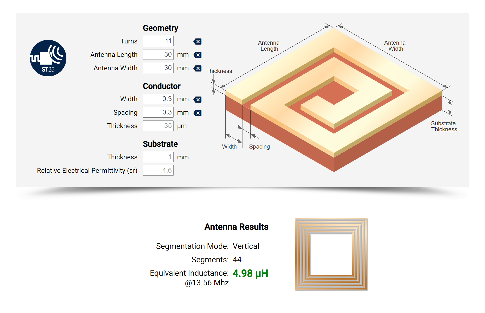
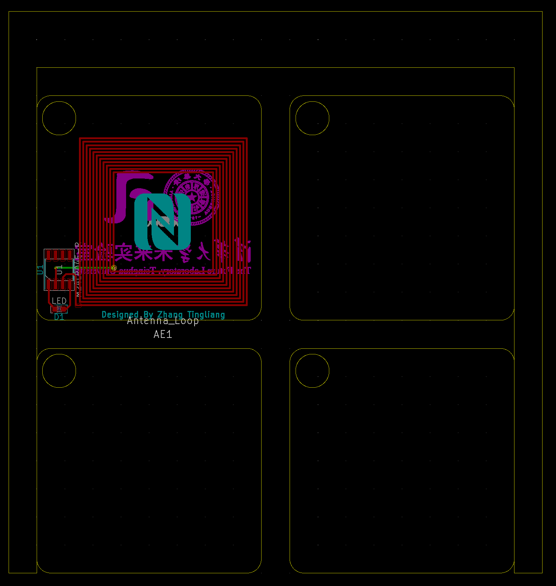
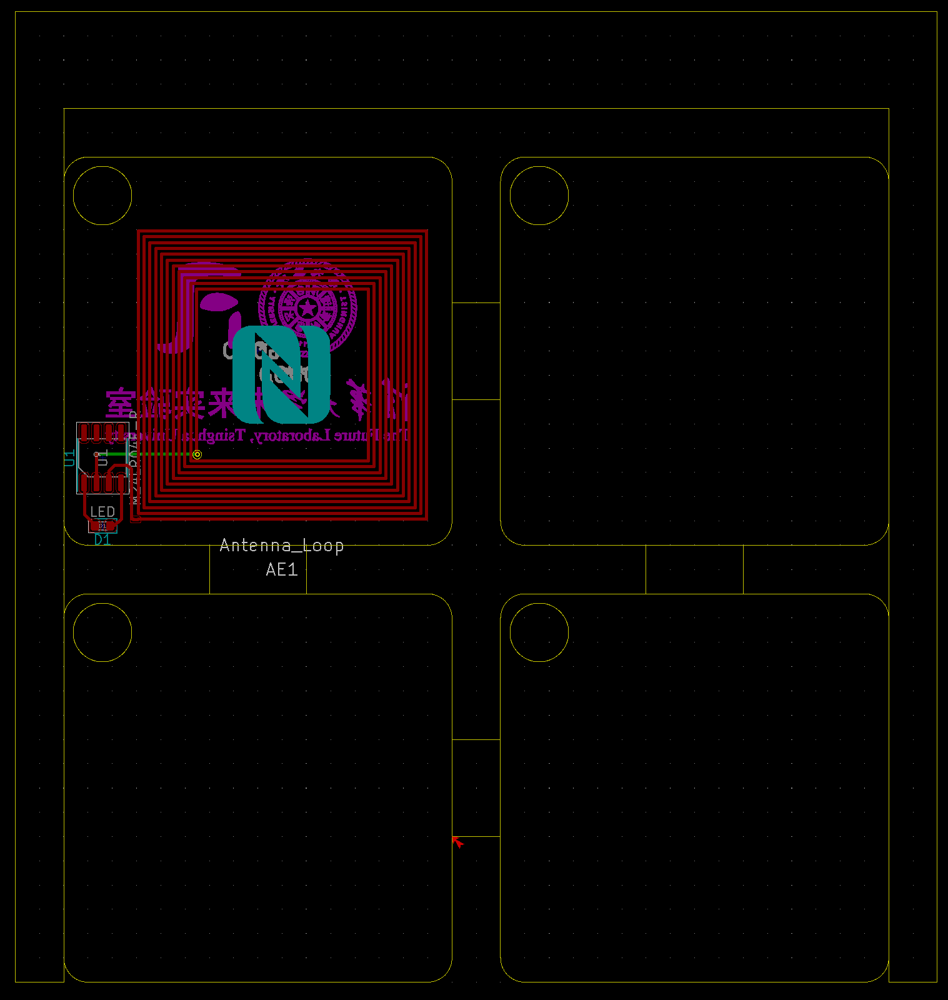
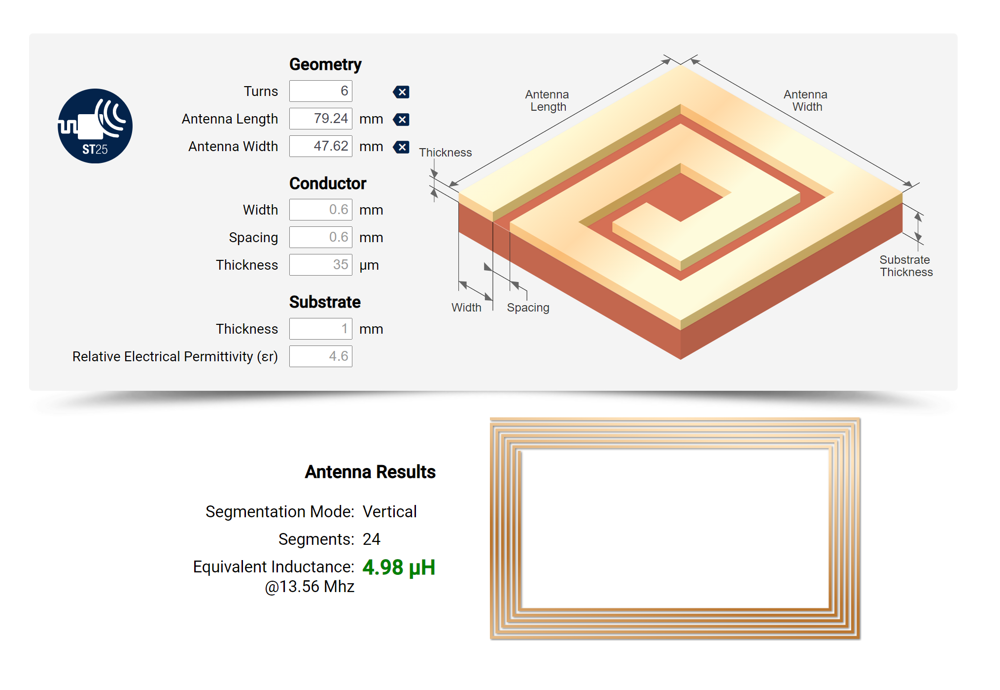
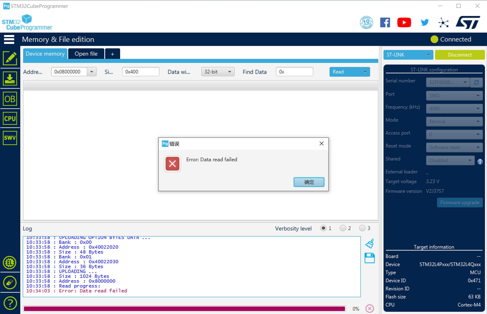
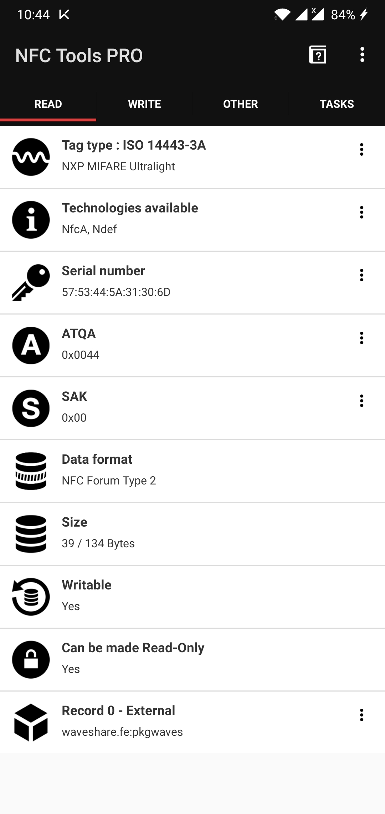
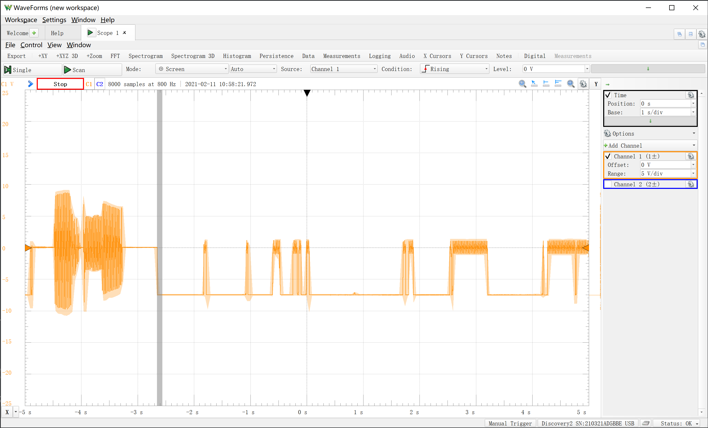

# Girl's Day of 2021 Presents Design
2021年交叉班女生节礼物——名片 设计

智能名片交互hhh


## 功能

Tagmo - 制作自己的Amiibo

[Popl - Your digital business card](https://popl.co/)

卡里面只有一个ID和我们服务器网址信息，具体这张名片能传达多少社交信息就由用户在网页端或者客户端配置了。以及最好加密一下，防止被轻易拿去干别的，比如友商出个教程，我们的卡就都变成他们的了

[The Blue Smart Card](https://blue.social/) - Reinventing the Name Tag. Create your virtual identity and be social again.

[Mobilo - The Smart Business Card](https://www.mobilocard.com/)


[Fuze Card, 0.84mm innovative electronic card technology.](https://fuzecard.com/)

KickStarter页面 [Fuze Card](https://www.indiegogo.com/projects/fuze-card-your-whole-wallet-in-one-card--3#/): Your Whole Wallet in One Card

[Unbox Therapy](https://www.youtube.com/channel/UCsTcErHg8oDvUnTzoqsYeNw)评测视频：[Your Whole Wallet In One Card](https://www.youtube.com/watch?v=7SPOVJi3H6g)


[Find Your Keys, Wallet & Phone with Tile's App and Bluetooth](https://www.thetileapp.com/en-us/)


[2.13寸 无源NFC 墨水屏 e-paper ESL电子货架标签 无线供电/刷新](https://item.taobao.com/item.htm?id=613699970326)

微雪NFC墨水屏标签


[小米碰碰贴2](https://item.jd.com/100014996634.html) nfc感应开关 全能投屏音乐接力碰触连网一碰连接米家智能场景


## 可参考项目

[PCB Business Card With NFC](https://www.instructables.com/PCB-Business-Card-With-NFC/) - 能存网址的名片

[THE NFC KEY](https://n-o-d-e.net/nfckey.html) - 存储密钥的带物理按键NFC

[Digital Business Card With NFC](https://www.instructables.com/Digital-Business-Card-With-NFC/) - 只是把NFCTag扔进两张纸之间去了。

[StyloCard](https://mitxela.com/projects/stylocard) - 乐器名片

[L-ink_Card](https://github.com/peng-zhihui/L-ink_Card) - 带墨水屏的NFC Tag

## 问题

手机的NFC功能可能默认关闭，而且NFC线圈位置不固定：苹果在正面顶部，安卓手机大多在背面。


## 进度追踪

2020/12 提出想法，女生节送智能名片

2021/1/27 开始设计

2021/1/28-29 元件选型和天线参数计算

2021/1/30-2/2 天线python脚本生成编写

2021/2/2 第一版测试板交付嘉立创打样，同时采购了元件，同时着手买NFC和RFID读取器

2021/2/4 V2交付打样，使用白色阻焊，尝试效果

2021/2/7 V1V2打样完成，焊接测试完成，功能完好

2021/2/8 开始规划网站服务，并学习React框架

2021/2/9 M24LR-discovery到货，验证了M24能用3.3V驱动STM32L系列单片机和一个液晶数位屏

2021/2/10 诚驰大哥加入，换用VUE框架，小菜鸡我同步开始学Vue

2021/2/11 除夕，依然干活，微雪的2.7inch NFC e-paper到货，测试尝试复现，并用电纸屏送上新年祝福

2021/2/12 大年初一，选取UX和UI设计工具，开始学习Figma

2021/2/13 开工画UX，画了一上午画出来一个登录界面，UX设计师真不容易，决定先用iPad的Procreate来画草图。

2021/2/15 用户体验设计碰头会，根据建议大改了交互流程，继续画了卡片管理界面，同时注册域名

2021/2/16 交给诚驰写网站，开始头大的Ruby和Jekyll开发环境配置

2021/2/17 搞网站备案，头大，Ruby和Jekyll开发环境还是没配好

2021/2/18 为了拿备案服务号，购买了阿里云一年的主机，并且配置Ubuntu环境和VS Code网页版，终于提交管局审核。把一大箱硬件开发的东西寄回清华。

2021/2/19 把Ruby和Jekyll开发环境配置好，其实就放弃了动态构建，只用build吧，研究Jekyll主题的使用

2021/2/20 返校，使用Ubuntu环境跑Jekyll

2021/2/21 - 22 组装服务器并给服务器装系统，走了很多弯路

2021/2/23 装好了Debian KDE 图形化系统，开始探索如何装虚拟化环境、网站部署

2021/2/24 开始部署Proxmox VE虚拟化服务，遇到了网关和DNS一系列问题

2021/2/25 两网站备案成功，但是服务器还是没跑起来，考虑回退回Debian Buster单系统，继续部署网站。

2021/2/26 开始第二个版本的PCB，准备采用黑色Silkskin，银色Paste，背面参考PCB尺子的设计。同时写社交模式。


## To Do List

- [x] 云服务器配置
- [ ] 本地服务器搭建（Dell R720）
- [x] 域名注册
- [x] 域名备案
- [ ] SSL证书（上https）
- [ ] 网站搭建
- [ ] PCB外观设计
- [ ] 自动生成PCB脚本编写（集成bitmap2component）
- [x] 硬件原理调试
- [x] UX和UI设计
- [ ] 用户体验测试（大雾）
- [ ] SD卡大小Tag设计和测试，特别是V槽拼版
- [ ] 加入墨水屏


## 工具

[KiCAD](http://www.kicad.org/)及其插件

[Interactive HTML BOM plugin for KiCad](https://github.com/openscopeproject/InteractiveHtmlBom)

[AutoCAD](https://www.autodesk.com/products/autocad/overview) 2021 Edu Edition


Linux下软件：

[Krita | Digital Painting. Creative Freedom.](https://krita.org/) 绘画软件

[Draw Freely | Inkscape](https://inkscape.org/) 矢量图编辑器


## 外形设计Outline

依据身份证等使用的ISO 7810-2003国际标准中的ID-1：ID-1的规定尺寸为85.60×53.98毫米（3.370×2.125英寸），常用于身份证、银行卡（如提款卡、信用卡）、驾照、个人名片，以及商店发出的忠实顾客卡等。其长宽比与黄金分割（1.618:1）接近。

ISO 7813规范ID-1塑胶银行卡的附加特性，包括0.76毫米厚度，及3.18毫米半径的圆角。

所以设计为

85.60×53.98毫米

3.18毫米半径的圆角

0.76毫米厚度（做0.8mmPCB板）

横向排版


或者用ID-3画成小的钥匙链


## Tile大小版本设计

Tile Pro：42mm x 42mm x 6.5mm  孔7mm直径

Tile Mate：35mm x 35mm x 6.2mm 孔6.5mm



初步设计为 40mm x 40mm x 1.6mm 孔6mm直径 倒角5mm直径圆

天线尺寸为30x30mm 0.3x0.3mm 11圈，电感4.98uH(@13.56Mhz)

天线封装焊盘为 0.3 x 0.5mm圆形通孔（嘉立创双面板最小过孔内径0.3mm,最小外径0.5mm）和 0.3 x 0.5mm矩形贴片焊盘


[嘉立创教学系列之：各软件拼板作业指引](http://club.szlcsc.com/article/details_468_1.html)

嘉立创拼版V割出货：走线和焊盘距板边距离≥0.4mm，否则可能涉及到板内的线路及焊盘，如果是拼版，则线离边必须要有0.4mm间距，否则v割会伤到线路。如果是单片出货，则需要帮≥0.2mm的间距。

VCUT(V割)板边离线的距离不小于0.4MM，CNC（锣边）正常是版边离线的距离不小于0.3MM，内槽离走线离线的最小距离不得小于0.3MM

V-CUT（V割工艺）：

（1）V割的拼板，板与板相连处不留间隙，也就是两块板外形线重叠放置，但是要注意，板子内的导线离V割线距离不小于0.4mm，以免切割时伤到走线。

（2）一般V割后残留的深度为1/3板厚，产品手动掰开后由于玻璃纤维丝有被拉松的现象，尺寸会略有超差，个别产品会偏大以上。

（3）V-CUT刀只能走直线，不能走曲线和折线。

（4）拼板尺寸在8cm以上才能做V-CUT工艺。


拼版设计：

可以考虑30cm x 30cm 九块边缘倒角板子拼起来，横排中间留2mm锣边，纵排无间距V割，纵排两侧有5mm工艺边和2.0mm定位孔及1.0mm的Mark点（一个焊盘）。

全部画在EdgeCut里面就好，嘉立创OEM会帮忙加V割或者锣边，如果版式一样，可以只画一个电路。在复制EdgeCut层的时候，可以在右边隐藏别的层。



由于强度问题，拼版V割的话还是要紧密连接，不能像上面这种设计。必须要加支撑才行。



但是拼版订单要多加钱。

所以还是先打单板吧。


## 简笔画头像生成

CV算法生成简笔画头像

[ArtLine](https://github.com/vijishmadhavan/ArtLine)

运行环境：[Colab](https://colab.research.google.com/github/vijishmadhavan/Light-Up/blob/master/ArtLine.ipynb)

CoLab中图片拖到根目录去上传，之后导入：

```python
img = PIL.Image.open("cai.jpg").convert("RGB")
```

[U-2-Net](https://github.com/NathanUA/U-2-Net)还有其前身[APDrawingGAN](https://github.com/yiranran/APDrawingGAN)


## 芯片选型

NXP NTAG

https://www.themobileknowledge.com/wp-content/uploads/2018/07/02-Webinar-slies-Antenna-design-for-NTAG-I2C-plus.pdf


ST25 Dynamic NFC Tags

https://www.st.com/en/nfc/st25-dynamic-nfc-tags.html

ST25DV04K

https://www.st.com/en/nfc/m24lr04e-r.html#overview

[M24LR04E-RMN6T/2](https://item.szlcsc.com/168717.html)[射频卡芯片](https://list.szlcsc.com/catalog/981.html)

测试板：

[M24LR-DISCOVERY](https://www.st.com/en/evaluation-tools/m24lr-discovery.html)

[X-NUCLEO-NFC02A1](https://www.st.com/en/ecosystems/x-nucleo-nfc02a1.html)

## NFC线圈设计

NFC Antenna Generator

https://kbeckmann.github.io/2016/06/19/NFC-Antenna-Generator/

[NFC Antenna Design | RF Design | eDesignSuite](https://eds.st.com/antenna/)


电路中天线电感计算计算：

主要参考AN2866 -  Antenna design procedure

Internal tuning capacitor in ST25DV04K SO8N(f = 13.56 MHz) $C_{TUN} = 28.5 pF$

计算公式：$L_{A} C_{S} \omega^{2}=1$

具体推导：
$$
L_{A}=\frac{1}{4 \pi^{2} f^{2} C_{S}}
$$

$$
L_{A}=\frac{1}{4*3.14^{2}*13.56^{2}*28.5}=4.84uH
$$

谐振理论：

At low frequencies $\left(f<f_{\text {self res }} / 10\right),$ the stray capacitance $C_{\text {ant }}$ is negligible, $L_{A}=L_{\text {ant }}$ and the antenna reactance is given by $X_{A}=j L_{\text {ant }} \omega$.
At $13.56 \mathrm{MHz}, \mathrm{C}_{\text {ant }}$ value gets in the range of some $\mathrm{pF}$ and $\mathrm{L}_{\mathrm{A}}>\mathrm{L}_{\text {ant }}$.

The antenna impedance is $Z_{\text {ant }}=R_{A}+j L_{A} \omega$.

The NFC / RFID chip impedance is $Z_{S}=R_{s}+j / C_{S} \omega$.

For the equivalent RLC circuit, the total impedance is $Z_{\text {tot }}=Z_{\text {ant }}+Z_{s}$ and the resonant frequency is given by the condition $L_{A} C_{S} \omega^{2}=1$.
Optimum antenna tuning

At resonant frequency the total impedance reaches its minimum value $Z_{\text {tot }}=R_{A}+R_{S}$. The current in the antenna and the voltage delivered to the NFC / RFID chip are maximized, as the energy transferred to the device.


物理天线电感

嘉立创PCB成品外层铜厚1oz~2oz(35um~70um)选择35um

单片出货，走线和焊盘距板边距离≥0.2mm，否则可能涉及到板内的线路及焊盘。

直接留3.18mm边缘。

最小线隙，多层板3.5mil 单双面板5mil (1mil=1/1000inch=0.0254mm)

Antenna Length =  85.60 - 3.18x2 = 79.24 mm

Antenna Width = 53.98 - 3.18x2 = 47.62 mm

Turns = 6

Equivalent Inductance@13.56 Mhz = 4.98 µH

考虑到布线过程中的寄生电容等，接近4.84 µH，可以接受这一设计。




动态NFC天线计算主要参考 AN2972 How to design an antenna for dynamic NFC tags 

封装库画六圈螺线太难了，准备用dxf导入，先使用Adobe Illustrate绘制，依然太麻烦放弃。

还是写py脚本向导吧。


## NFC Antenna创建向导编写

参考官方示例

https://docs.kicad.org/5.1/en/pcbnew/pcbnew.html#Footprint_Wizards

[KiCad Scripting Examples](https://kicad.mmccoo.com/?page_id=83)

参考C:\Program Files\KiCad\share\kicad\scripting\plugins中的脚本。

C:\Users\Zhang\AppData\Roaming\kicad\scripting\plugins

[KiCad](https://github.com/KiCad)/**[kicad-footprint-wizards](https://github.com/KiCad/kicad-footprint-wizards)**

Defining Parameters

Footprint wizards are written in Python and are simple to develop. Each footprint wizard defines a number of footprint parameters, which are organised into categories called "Pages". [Read further on footprint parameters](https://github.com/KiCad/Footprint_Wizards/wiki/Footprint-Parameters)

主要参考microMatch_connectors.py，焊盘直接用SMD的长方形焊盘

To greatly simplify development of custom footprint wizards, the FootprintWizard base class is provided, and only a handful of simple functions need to be written for each wizards. [Read further on minimum wizard requirements](https://github.com/KiCad/Footprint_Wizards/wiki/Minimum-Wizard-Requirements)

先画一个最简单的练手


注意每次更改需要重启KiCAD新脚本才能生效，DeBug的时候因为这个浪费了不少时间。如果加载脚本失败，可以看到报错信息。

通过self.AddParam("Conductor", "spacing", self.uMM, 0.6)传递进来的 self.uMM 其实是已经转化成nm为单位的整型变量了，不需要再用pcbnew.FromMM(1.0)转换为nm。


算法可参考HTML的脚本，but我选择自己写hhh

二维数组需要初始化，测试py文件单独编写测试，VScode在安装Python插件后可以在Debug标签页查看变量。


之后手动添加焊盘，嘉立创双面板最小过孔内径0.3mm,最小外径0.5mm，一号焊盘用0.6x1.524mm矩形贴片，注意取消勾选F.Paste和F.Mask工艺层以令外观美观，二号焊盘用圆形通孔0.8x0.5mm，注意取消勾选F.Mask和B.Mask工艺层以令外观美观

左下角：（100，100）

右上角：（185.6，46.02）

中心定位点：（142.8，73.01）


## 信息填写

QR Code Wizard使用丝印层而非铜层

> Use SilkS layer: True
> Use Cu layer: False


字符：

最小字符：线宽6mil 字符高40mil，参数为极限值，尽量大于此参数

故字符采用0.2mm线宽 1mm字符高度

目前仅支持英文字符，KiCAD 6.0 将支持中文字符输入


## 矢量图导入

使用KiCAD主页 位图转换为元件 工具进行转换，直接可以导出kicad_mod文件，注意选择顶层丝印。

调黑白阈值还是很丑的，可以考虑通过Artline生成简笔画。

调整尺寸需要通过调分辨率实现，DPI越高图片越小。注意名片尺寸为85.60×53.98毫米，合适的头像应当为30mm x 30mm

同学们的头像参数调节

| Who      | DPI  | 尺寸      | 黑白阈值 |
| -------- | ---- | --------- | -------- |
| NFC Logo | 4000 | 10 x 10mm | 30       |
| cai      | 600  | 26 x 26mm | 80       |
| luna     | 700  | 30 x 30mm | 70       |
| danni    | 300  | 37.3      | 30       |


[Artistic PCB Design for Terrified Beginners](https://wiki.hope.net/index.php?title=Artistic_PCB_Design_for_Terrified_Beginners_workshop)


## NFC + 墨水屏

[实用新型] 一种无源NFC电子墨水屏显示系统 申请号：2020204091829

微雪e-Paper相关资料

https://www.waveshare.net/wiki/Main_Page#Display-e-Paper

特别是驱动板如[e-Paper Driver HAT](https://www.waveshare.net/wiki/E-Paper_Driver_HAT)等

但是屏线多数是SPI，所以估计需要一个STM32转接一下，其实之后的按键等外围设备也需要一个单片机来做。


NFC墨水屏模块

https://www.waveshare.net/wiki/2.7inch_NFC-Powered_e-Paper_Module

NFC烧写器开发板

https://www.waveshare.net/wiki/ST25R3911B_NFC_Board


购买了以上两种产品，发现NFC墨水屏的主控芯片型号竟然被磨掉了。。。


通过SWD接口接入，读取到型号是[STM32L4P5/Q5](https://www.st.com/en/microcontrollers-microprocessors/stm32l4p5-q5.html)，不出所料，ultra‐low‐power系列。



旁边的那个写着ofz 02f s20x的6pin芯片是 TPS62122，降压dcdc

NFC Tag估计是用STM32搞的，用NFC Tools Pro读取得到型号，是一个NXP MIFARE Ultralight



现在量一下电容充电曲线，7.5V，在识别和写图的时候充能，但是没有明显的充放电，应该就是个小电容。



## V1V2焊接调试

注意ST24的marker是一边的斜边对应1号脚所在的位置，其实反色的ST标着对应的也是marker。


在不带载的情况下，EH输出大约为0.5V以下。暂时不上LED了，LED允许电压普遍在2.5V 20mA左右，可能会BOOM。下个版本加电阻吧。


## V3名片设计

增加LED限流电阻

在背面增加两个具有代表性的SMD芯片封装，贴片装饰LQFP-100和BGA-1mm-256

删除头像丝印，规范个人信息排版方式

删除中心定位焊盘


背面参考PCB尺子的设计

最典型的就是NVIDIA的尺子，但是可能找不到源文件，只能找类似的参考。

嘉立创PCB

https://lceda.cn/OSHWHubkai-yuan-ying-jian/li-chuangeda-chi-zi

Github and KiCAD

[PCBruler Github Repo](https://github.com/jbtronics/PCBruler)  [PCBrulerS Project Intro](https://hackaday.io/project/25482-pcbrulers) 准备主要参考这一个

[PCB Business Card Ruler With QR and NFC](https://www.instructables.com/PCB-Business-Card-Ruler-With-QR-and-NFC/)

Eagle 开源

[Adafruit-PCB-Ruler](https://github.com/adafruit/Adafruit-PCB-Ruler)

[SparkFun_PCB_Ruler](https://github.com/sparkfun/SparkFun_PCB_Ruler)

## V4钥匙链设计

缩小钥匙孔、线圈、整个的尺寸，到30x30cm，以便一个10x10的上面能打9个。

在正面印上未来交互的图案，背面印上二维码。和部分装饰性丝印，比如LQFP-64和BGA-100


## 服务器搭建

服务器选型

Dell R720 2U刀片服务器 3.5寸盘架x8  双路至强E5-2678V2 20核40线程处理器 16G内存 H710阵列卡 3T储存空间（后续可扩容） 750W电源 100Mbps带宽 公网IP

最好带有DELL IDRAC7 企业版授权

BUT 校内1024以下端口不开，而且会被学校查水表，不让校内建站。所以可能还是学生机更好。。。

使用阿里云学生机吧。。。

三丰云可以免费用，但是只用作测试，不能用为生产环境，因为每五天需要点一次延期，太过分了。


[PowerEdge R720](https://www.dell.com/support/home/zh-cn/product-support/product/poweredge-r720/overview)

服务编号(Service Tag)：C8L4Z42

操作系统选择Debian+KVM(Ubuntu+WinServer)

插上E5-2680v2，内存条，开机

第一次开机先清一下H710的默认值，可能之前的设置不对。

重启后按F2进入System Config，最后发现是盘没插好，2.5寸用3.5寸盘架还是有点问题，换成3.5寸就好了

F2-System Setup - Device Settings - H710 Raid setting - Create new virtual disk - Save and restart   就可以成功挂在硬盘到阵列卡上面了，当有 1 Virtual Device 的时候就说明成了。

但是又识别不到U盘了，可能是因为有阵列卡？也可能没断电插拔？重新烧写后按F10-BOOT setting 选择USB设备启动。


注意Debian Live KDE的安装界面锁屏默认密码为Live


总结：首先F2-System Setting - Device Setting - H710 - Create new virtual disk - Initialize - Fast Initialize 

替代办法：https://jingyan.baidu.com/article/4b52d702b7d396fc5d774b49.html 直接ctrl + R进入Raid设置

在BIOS Setting 确认SATA setting是Raid

重启，没有直接引导，需要按F11选择C：-- USB 启动即可


安装的时候BUG无法分区...搜了一下，是因为2T+硬盘要切换成UEFI

[Dell R720上的系统安装问题的解决办法](https://www.cnblogs.com/wgp13x/p/3750957.html)


可以使用[Microsoft Windows and Office ISO Download Tool](https://www.heidoc.net/joomla/technology-science/microsoft/67-microsoft-windows-and-office-iso-download-tool)下载Windows系统，但是好像没有Windows Server 2019

先安Debian：[Debian 64 位 PC（amd64）的安装手册](https://www.debian.org/releases/stable/amd64/)

去tuna下载[Debian 10.8.0 (amd64, DVD installer (Part 1))](https://mirrors.tuna.tsinghua.edu.cn/debian-cd/current/amd64/iso-dvd/debian-10.8.0-amd64-DVD-1.iso)

先安Ubuntu吧qwq

[Installation instructions for Ubuntu Server ](https://ubuntu.com/tutorials/tutorial-install-ubuntu-server)

按照[Create a bootable USB stick on Windows](https://ubuntu.com/tutorials/create-a-usb-stick-on-windows)使用[Rufus](https://rufus.ie/)烧写U盘

最后还是决定用Debian了。。。在Debian里在搞虚拟化主机KVM安Windows之类的

TFTP网络配置需要认真看看。


操作系统选择方面，先使用VirtualBox尝试安装，比如Debian Live之类的。

Debian的各种桌面环境参考：https://www.eet-china.com/mp/a10976.html

[Debian 10.8.0 (amd64, Live CD with gnome and non-free firmware)](https://mirrors.tuna.tsinghua.edu.cn/debian-nonfree/images-including-firmware/current-live/amd64/iso-hybrid/debian-live-10.8.0-amd64-gnome+nonfree.iso)


总结如下：

1. 建立Raid
- 开机，按ctrl+R进行Raid配置
- 选择Raid卡，按F2，清除现有Raid
- 光标选择到Raid卡，按F2，create new VD，将6个HD全做Raid5（或Raid6）
- 按F2，init VD （初始化VD）
- 配置完成后重启
2. 开机按F2进行BIOS设置 （如果总硬盘小于2T此步略去）进入BIOS，将启动模式选择成UEFI
3. 开机按F11进行UEFI启动（如果总硬盘小于2T此步略去）
4. 进入Boot Manager，选择UEFI Boot Menu（如果总硬盘小于2T，选择Bios Boot Menu）
5. 选光驱（插入系统盘）
6. Press any key to install OS

后续高分屏问题解决：尝试使用Quadro K2200专业卡，使用DP输出，但是后面板挡住了DP线，需要一个扁平一点的DP。


## 域名备案相关

总的来说：麻烦到爆炸

在购买域名的代理商处进行域名实名认证，在购买云服务器的运营商拿备案服务号，并走备案网站流程。

首先域名实名认证，三天后同步到管局，进行网站备案

在阿里[备案入口](https://beian.aliyun.com/)上传一大堆资料和无数次验证码之后，提交初审，一个工作日后会给你打电话确认，把你的资料改一遍，个人申请不能涉及团队，之后提交管局。

工信部会给你发个短信再次查验身份。

阿里云管局审核最快也得一周以后，基本上通过都是两周以后

备案成功后，会给你的手机，邮箱发送一个备案密码，以及备案号，备案密码一定要好好保管，备案密码是以后变更备案信息的重要依据。

我今天（2021年2月18日）提交的管局审核，女生节前希望能批下来。


## 阿里云服务器相关

纠结好久，最后选择购买阿里云的[轻量应用服务器](https://www.aliyun.com/product/swas)，首先有学生价，其次可以安装Ubuntu，比腾讯云的轻量应用服务器要好。

最主要的是，[网站备案](https://beian.aliyun.com/)需要的[备案服务号](https://help.aliyun.com/document_detail/36938.html)轻量应用服务器实例可以提供5个（参见[支持备案的云服务及备案网站数量](https://help.aliyun.com/document_detail/36891.html)）

我选择安装Ubuntu20.04，进去之后好快啊，通过输入“sudo su root”切换至root账号

可选[用VNC搭建Ubuntu VNC可视化界面](https://help.aliyun.com/knowledge_detail/59330.html)

vnc4server还没出Ubuntu20.04版本的，啊这。。。

我还是用[code-server](https://github.com/cdr/code-server)吧。

### Code-Server安装

> If you choose to use the install script, you can preview what occurs during the install process:
>
> ```sh
> curl -fsSL https://code-server.dev/install.sh | sh -s -- --dry-run
> ```
>
> To install, run:
>
> ```sh
> curl -fsSL https://code-server.dev/install.sh | sh
> ```

### Code-Server SSH forwarding

首先在阿里云设置ssh密码，其实就是root账户的密码。

注意一开始的sed命令要使用admin而非root，而最后本地的user阿里云设置的密码是root密码。

> First, ssh into your instance and edit your `code-server` config file to disable password authentication.
>
> ```sh
> # Replaces "auth: password" with "auth: none" in the code-server config.
> sed -i.bak 's/auth: password/auth: none/' ~/.config/code-server/config.yaml
> ```
>
> Restart `code-server` with (assuming you followed the guide):
>
> ```sh
> sudo systemctl restart code-server@$USER
> ```
>
> Now forward local port 8080 to `127.0.0.1:8080` on the remote instance by running the following command on your local machine.
>
> Recommended reading: https://help.ubuntu.com/community/SSH/OpenSSH/PortForwarding.
>
> ```sh
> # -N disables executing a remote shell
> ssh -N -L 8080:127.0.0.1:8080 [user]@<instance-ip>
> ```
>
> Now if you access [http://127.0.0.1:8080](http://127.0.0.1:8080/) locally, you should see `code-server`!

总结：SSH到云端执行的

```sh
sed -i.bak 's/auth: password/auth: none/' ~/.config/code-server/config.yaml
sudo systemctl restart code-server@admin
```

在本地执行

```sh
ssh -N -L 8080:127.0.0.1:8080 root@47.94.150.220
```

用chrome打开 [http://127.0.0.1:8080](http://127.0.0.1:8080/) 即可访问网页端VScode。

所以每次都得在WSL的Ubuntu里面执行一下再打开浏览器

## 网站搭建

- [ ] 班级主页
- [ ] 个人主页
- [ ] 博客
- [ ] E-mail系统
- [ ] iTag系统
- [ ] 私信系统


### 备案相关注意事项

[【备案】关于网站主页下方标明备案编号的通知（2020年12月28日）](https://help.aliyun.com/noticelist/articleid/1060773630.html)


候选框架：

[Hexo](https://hexo.io/zh-cn/)

[Jekyll](https://jekyllrb.com/)

The world’s fastest framework for building websites | [Hugo](https://gohugo.io/)

[Dreamwaver](https://www.adobe.com/products/dreamweaver.html)自带Bootstrap模板


班级主页

博客

参考网站： [Harry Chen's Blog](https://harrychen.xyz/)

Jekyll主题

https://jamstackthemes.dev/

[beautiful-jekyll](https://github.com/daattali/beautiful-jekyll)

https://jekyllrb.com/docs/


## [Minimal Mistakes Jekyll theme](https://mmistakes.github.io/minimal-mistakes/)

首先安装[Jekyll](https://jekyllrb.com/)，Windows测试选择使用WSL安装

https://jekyllrb.com/docs/installation/windows/

WSL安装：在 程序和功能 中使能 适用于 Linux 的 Windows 子系统，之后在Windows应用商店安装Ubuntu，之后可以通过shift+右键打开bash，也可以在powershell里面输bash激活。

[Install WSL & update to WSL 2](https://docs.microsoft.com/en-us/windows/wsl/install-win10)

Before installing WSL 2, you must enable the **Virtual Machine Platform** optional feature. Your machine will require [virtualization capabilities](https://docs.microsoft.com/en-us/windows/wsl/troubleshooting#error-0x80370102-the-virtual-machine-could-not-be-started-because-a-required-feature-is-not-installed) to use this feature.

一开始我以为是bash和虚拟机冲突导致闪退，结果是我没安应用商店的Ubuntu。。。

2021/2/17早上6点更新：WSL还是太麻烦了，在`gem update`卡住了，还是换成[RubyInstaller](https://rubyinstaller.org/) for Windows.

[RubyInstaller](https://rubyinstaller.org/) for Windows 还是挺人性化的，跟着引导安就好。

> 1. Download and install a **Ruby+Devkit** version from [RubyInstaller Downloads](https://rubyinstaller.org/downloads/). Use default options for installation.
> 2. Run the `ridk install` step on the last stage of the installation wizard. This is needed for installing gems with native extensions. You can find additional information regarding this in the [RubyInstaller Documentation](https://github.com/oneclick/rubyinstaller2#using-the-installer-on-a-target-system)
> 3. Open a new command prompt window from the start menu, so that changes to the `PATH` environment variable becomes effective. Install Jekyll and Bundler using `gem install jekyll bundler`
> 4. Check if Jekyll has been installed properly: `jekyll -v`

新建一个 `index.html` 

```html
<!DOCTYPE html>
<html>
  <head>
    <meta charset="utf-8">
    <title>Home</title>
  </head>
  <body>
    <h1>Hello World!</h1>
  </body>
</html>
```

之后使用`jekyll build` 编译，`jekyll serve --livereload`暂时没跑通，有bug

注意在Gemfile里面要使用[Bundler](https://bundler.io/) command才能顺利安装各种gem包

用`jekyll serve --livereload`直接动态编译依然报错，原因应该是 EventMachine 还没支持 Ruby 3.0，算了暂时只build看看吧。

气，卸了换成Ruby 2.7.2

还是报错，不过我终于找到了解决方案：

https://github.com/oneclick/rubyinstaller2/issues/96#issuecomment-679206413

> For Ruby 2.5 and later, try:
>
> ```sh
> gem uninstall eventmachine
> ridk exec pacman -Sy openssl
> gem install eventmachine --platform=ruby
> 
> # 最后运行一下，以解决 Could not find eventmachine-1.2.7-x64-mingw32 in any of the sources 的bundle错误
> bundle update
> ```
>
> `ridk exec pacman -Sy openssl` updates MSYS2 and installs the MSYS2 openssl package. This may take a little while...
>
> `gem install eventmachine --platform=ruby` installs EventMachine but forces compiling the gem
>
> EventMachine's current x64-mingw32 gem is not compatible with Ruby 2.6 and later, and it was accidentally built without that information in the gemspec.

重新编译时间长，完事还是会报错

> If you are using windows
>
> Go to this folder `C:\Ruby24-x64\lib\ruby\gems\{version of ruby}\gems\eventmachine-1.2.5-x64-mingw32\lib`
>
> open this file `eventmachine.rb`
>
> write this `require 'em/pure_ruby'` in the first line of code in the file
> this will make it work with no issues.

这次不报`Unable to load the EventMachine C extension; To use the pure-ruby reactor, require 'em/pure_ruby'`错了，报了`pure_ruby.rb:559:in `close': Bad file descriptor (Errno::EBADF)`

看各种stack overflow貌似是端口占用？

放弃。。。Ruby真不友好。。。


先尝试示例吧，在test下面

```sh
cd ./test
bundle update
jekyll server
jekyll server --livereload
```

woc，竟然直接成了。。。程序样例赛高~ さいこう

但是如果打开livereload会发现如下信息

```sh
This port only serves livereload.js over HTTP.
```

也就是说还需要别的才能实时。


## VirtualBox + Ubuntu20.04

为了给Ruby提供测试环境，安一个Ubuntu虚拟机，预计之后的云服务器和本地自建服务器生产环境都是Ubuntu20.04。

设置root密码

```sh
$ sudo passwd
[sudo] grace 的密码:        #输入grace账号的密码
新的 密码:                  #定义root密码
重新输入新的 密码:           #确认root密码
password: 已成功更新密码     #成功提示
$ su                       #su验证登录
```

安装增强功能

```sh
$ su #切换root账号
$ apt-get update   #更新源
$ sudo apt-get install build-essential gcc make perl dkms  #安装依赖
$ reboot  #重启系统
```

直接 设备 -> 安装增强功能 -> 运行 -> 重启系统 是不行的，需要先安依赖。参考[VirtualBox Guest Additions installation problem ](https://askubuntu.com/questions/1035030/virtualbox-guest-additions-installation-problem)

```sh
# 如果没弹窗，可以手动运行.run文件
sudo ./VBoxLinuxAdditions.run
```

安gcc的时候报错：E: Unable to correct problems, you have held broken packages.

https://blog.csdn.net/xpy870663266/article/details/94742491

尝试修复：

```sh
$ sudo dpkg --configure -a
$ sudo apt-get update
$ sudo apt-get autoremove
$ sudo apt-get -f install
```

没用，手动安装指定的包吧。

尝试使用aptitude而不是apt-get

```sh
apt install aptitude
aptitude install build-essential gcc make perl dkms
```

还是没解决。


常见的疑难杂症：

[Unable to lock the administration directory (/var/lib/dpkg/) is another process using it?](https://askubuntu.com/questions/15433/unable-to-lock-the-administration-directory-var-lib-dpkg-is-another-process)  其实跟有可能你没sudo哈哈哈

不锁屏设置：System Settings-Privacy-Screen Lock-Automatic Screen Lock-Off

改镜像源：

Ubuntu 的软件源配置文件是 `/etc/apt/sources.list`。将系统自带的该文件做个备份，将该文件替换为下面内容，即可使用 TUNA 的软件源镜像。

```shell
# 默认注释了源码镜像以提高 apt update 速度，如有需要可自行取消注释
deb https://mirrors.tuna.tsinghua.edu.cn/ubuntu/ focal main restricted universe multiverse
# deb-src https://mirrors.tuna.tsinghua.edu.cn/ubuntu/ focal main restricted universe multiverse
deb https://mirrors.tuna.tsinghua.edu.cn/ubuntu/ focal-updates main restricted universe multiverse
# deb-src https://mirrors.tuna.tsinghua.edu.cn/ubuntu/ focal-updates main restricted universe multiverse
deb https://mirrors.tuna.tsinghua.edu.cn/ubuntu/ focal-backports main restricted universe multiverse
# deb-src https://mirrors.tuna.tsinghua.edu.cn/ubuntu/ focal-backports main restricted universe multiverse
deb https://mirrors.tuna.tsinghua.edu.cn/ubuntu/ focal-security main restricted universe multiverse
# deb-src https://mirrors.tuna.tsinghua.edu.cn/ubuntu/ focal-security main restricted universe multiverse

# 预发布软件源，不建议启用
# deb https://mirrors.tuna.tsinghua.edu.cn/ubuntu/ focal-proposed main restricted universe multiverse
# deb-src https://mirrors.tuna.tsinghua.edu.cn/ubuntu/ focal-proposed main restricted universe multiverse
```

具体先备份后用vi编辑后 :wq

```sh
cp /etc/apt/sources.list /etc/apt/sources.list.bak
rm /etc/apt/sources.list
vi /etc/apt/sources.list
```

不改的话会慢到龟速。。。当然阿里云就不用了，默认镜像源是阿里源，贼快。

Chromium以及VScode直接用应用商店安就好了。

完事可以尝试安装Ruby运行环境和


## 虚拟化操作系统搭建

KVM虚拟机选择

先在本地尝试，需要一个测试用电脑，我大一用的老笔记本挺合适的。2021/2/23晚重新启用老电脑

https://www.proxmox.com/en/

[Proxmox VE Wiki](https://pve.proxmox.com/wiki/Main_Page)

教程：基于Debian10搭建ProxmoxVE 6虚拟化环境 https://www.jianshu.com/p/411e66dba2b2

下载ISO镜像，可以选择清华TUNA源[proxmox-ve_6.3-1.iso](https://mirrors.tuna.tsinghua.edu.cn/proxmox/iso/proxmox-ve_6.3-1.iso)

[proxmox | 镜像站使用帮助 | 清华大学开源软件镜像站](https://mirrors.tuna.tsinghua.edu.cn/help/proxmox/)

烧写镜像

> Using Etcher
>
> Etcher works out of the box. Download Etcher from [https://etcher.io](https://etcher.io/). It will guide you through the process of selecting the ISO and your USB Drive.
>
> Using Rufus
>
> Rufus is a more lightweight alternative, but you need to use the **DD mode** to make it work. Download Rufus from https://rufus.ie/. Either install it or use the portable version. Select the destination drive and the Proxmox VE ISO file.
>
> Once you *Start* you have to click *No* on the dialog asking to download a different version of GRUB. In the next dialog select the *DD* mode.
>

插上去安装，按照提示安就好，最后通过https:// IP :8006 访问控制台。


在Debian之上安装PVE

[Install Proxmox VE on Debian Buster](https://pve.proxmox.com/wiki/Install_Proxmox_VE_on_Debian_Buster)

先尝试一下这个


Proxmox 镜像使用帮助

新建 `/etc/apt/sources.list.d/pve-no-subscription.list`，内容为：（Debian 10）

```
deb https://mirrors.tuna.tsinghua.edu.cn/proxmox/debian buster pve-no-subscription
```

ISO安装文件下载：https://mirrors.tuna.tsinghua.edu.cn/proxmox/iso/


R720上Proxmox的问题

貌似Proxmox识别到的IP段不对，是`192.168.100.2`，不是接入的网口的IP `192.168.50.xxx`，所以从其他电脑无法访问，而且会让router无法工作。

https://forum.proxmox.com/threads/fresh-install-sees-network-but-not-internet.83670/

改一下`/etc/network/interfaces`中对应网口的IP，改为对应的IP段，想要的IP，比如`192.168.50.233:22`，网关也改成对应的，比如`192.168.50.1`，Router就会自动给服务器分配一个静态IP。

注意编辑前cp一下备份。VI编辑器，I进入插入模式后，不要动前后左右键。ESC推出到命令模式。X删除当前字符。结合着来，:q!不保存强制退出，:qw保存并退出。

结果从服务器上ping路由器网关`192.168.50.1`，不通，搞了半天发现我网线插到了2号网卡上面，刚刚我配置的是1号卡。。。

https://192.168.50.233:8006/

在局域网下其他计算机浏览器中访问此页面即可进入管理页面，注意是HTTPS！

Default login is "root" (realm *PAM*) and the root password is defined during the installation process.


现在问题有俩，一个是DNS有毒，另一个是无法挂载exFAT格式的移动硬盘拷子系统镜像。

ping百度的IP能ping通，说明连上了公网，但是`apt-get update`全不行，说明DNS有问题。

编辑`/etc/resolv.conf`换用tuna的DNS：`101.6.6.6`

之后

```sh
service networking restart #重启网络
```

终于可以`apt-get update`了！

Debian10尝试重启没啥问题，不过Debian8和9貌似直接编辑`/etc/resolv.conf`重启后会重置，Debian 永久修改 DNS需要安装resolvconf包

```shell
apt-get install resolvconf -y
nano /etc/resolvconf/resolv.conf.d/head
prepend nameserver 101.6.6.6 #或者直接加一行
reboot #重启
```


首先，移动硬盘应该是exFAT格式，在Windows上先格式化好。其次需要挂载才能访问，挂载是到特定的文件夹中。

应该是把需要的iso文件放到`/var/lib/vz/image`中，即PVE的Storage-Directory-local，创建VM时会在这个文件夹下面去找，应该可以直接把移动硬盘挂载到这个路径里面，但是我还是cp一下，以备之后使用。具体操作如下：参考https://blog.csdn.net/u010334295/article/details/82592472

```sh
fdisk -l
cd ~
mkdir PortableDisk
mount /dev/sdb1 PortableDisk
chmod 777 PortableDisk #可选，复制出来文件不需要，777是最高权限
cd PortableDisk
ls
cp ./debian-live-10.8.0-amd64-kde+nonfree.iso /var/lib/vz/image/debian-live-10.8.0-amd64-kde+nonfree.iso
```

但是u其实并不行，还是找不到iso，之后再说吧。


草，其实双击Server View-interaction-Search-storage-local-ISOimage可以上传iso（可能需要多试几次才能蹦出来ISOimage），而且点interaction右上角的Shell-xterm.js或者左侧标签页的Shell还可以远程命令行。我跑来跑去真锻炼身体。。。

大草，甚至能在GUI下面改DNS。


## Nano Pi

因为遇到校园网问题：(IP地址异常，请重新拿地址) E2833: Your IP address is not in the dhcp table. Maybe you need to renew the IP address.

配置OpenVPN到工场暂时用一段时间。

玩转NanoPi R2S

中文维基 [NanoPi R2S/zh](http://wiki.friendlyarm.com/wiki/index.php/NanoPi_R2S/zh)

英文维基 [NanoPi R2S](http://wiki.friendlyarm.com/wiki/index.php/NanoPi_R2S)

SD卡自带FriendlyCore

FriendlyARM   NanoPi R2S 的核心  Rockchip RK3328 是 armv8 架构，所有智能用Openwrt官方的snapshot，还是刷FriendlyWrt吧。

### 基本使用

在电脑浏览器上输入以下网址即可进入FriendlyWrt管理页面:

- http://friendlywrt/
- http://192.168.2.1/

升级所有的软件包（慎用）

```sh
opkg update
opkg list-upgradable | cut -f 1 -d ' ' | xargs opkg upgrade 
```

升级之后万年起不来，重新烧写固件qwq

[FriendlyCore](http://wiki.friendlyarm.com/wiki/index.php/FriendlyCore_(based_on_ubuntu-core_with_Qt)) (based on ubuntu-core with Qt)是开发用的核心，FriendlyWrt的使用基本上和Openwrt一致。


### 安全的关机操作

进入ttyd终端，输入poweroff命令敲回车，待led灯熄灭，再拔开电源。


### 建议的安全性设置

以下设置事项非常建议在将 NanoPi-R2S 接入互联网之前完成，因为在空密码或弱密码的状态下将NanoPi-R2S接入互联网，极易受到网络攻击。

- 设置一个安全的密码

进入 系统->管理权 界面设置密码。

- 禁止从wan访问ssh，更换端口

进入 系统->管理权->SSH访问，将接口限制为 lan，将端口设置为其他非常用端口，例如 23333。

- 只允许本地设备访问luci

编辑 /etc/config/uhttpd，将原来的0.0.0.0和[::]地址改为本地lan的地址，例如：

```
	# HTTP listen addresses, multiple allowed
	list listen_http	192.168.2.1:80
	list listen_http	[fd00:ab:cd::1]:80
 
	# HTTPS listen addresses, multiple allowed
	list listen_https	192.168.2.1:443
	list listen_https	[fd00:ab:cd::1]:443
```

完成后重启服务：

```
/etc/init.d/uhttpd restart
```


### OpenVPN client using LuCI

https://openwrt.org/docs/guide-user/services/vpn/openvpn/client-luci

Install [openvpn-openssl](https://openwrt.org/packages/pkgdata/openvpn-openssl) and [luci-app-openvpn](https://openwrt.org/packages/pkgdata/luci-app-openvpn) to be able to manage OpenVPN using web interface.

```sh
opkg update
opkg install openvpn-openssl
opkg install luci-app-openvpn
```

也完全可以用图形化界面来搞，搞完重启就好。

注意配置Auth

```shell
auth-user-pass /etc/openvpn/Skyworks.auth
```

另外注意用Ubuntu的那个配置文件，复制粘贴进去，才能跑。

但是一直AUTH_fail不知道为啥了


## Debian相关

安装OpenVPN和RSA

```shell
# 安装OpenVPN和RSA
sudo apt-get install openvpn
# 复制粘贴配置文件
sudo cp skyworks.conf
# 可选添加一个auth-user-pass文件，注意搞完全地址
auth-user-pass /etc/openvpn/Skyworks.auth
# 启动服务
sudo openvpn --config /etc/openvpn/skyworks.conf
```